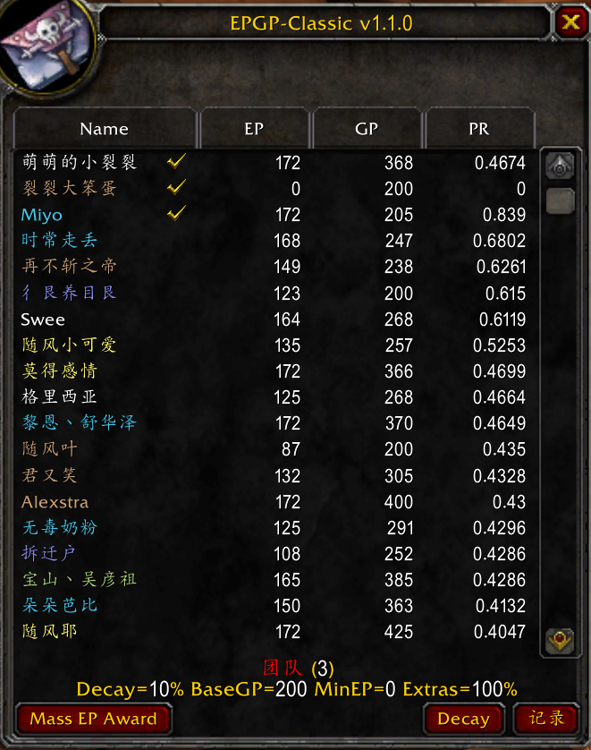
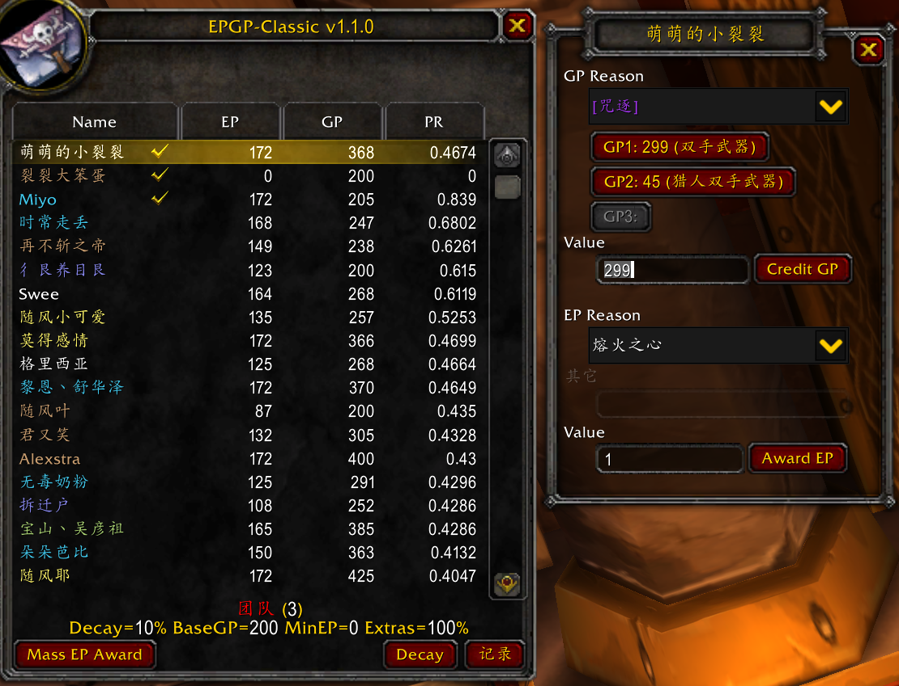
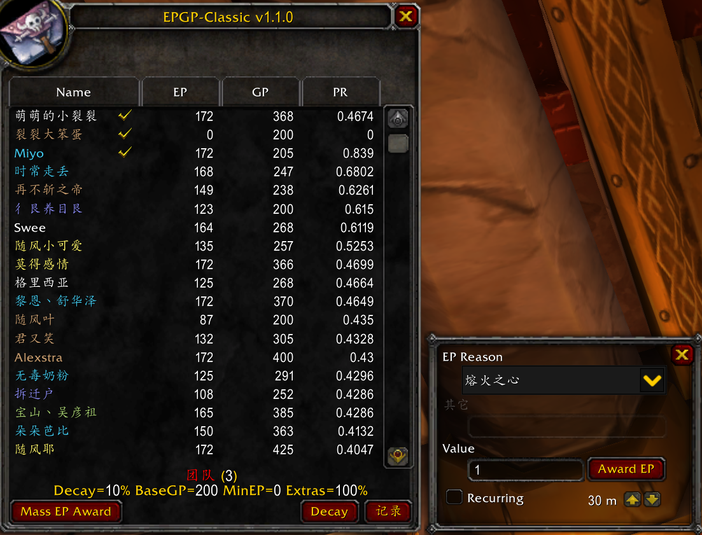
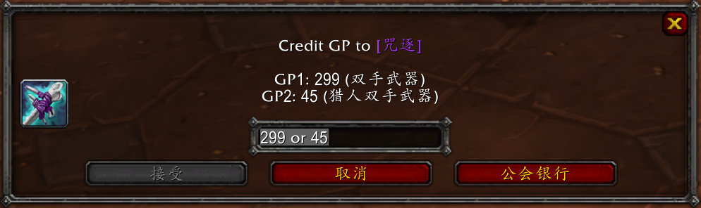

## 安装

- 彻底删除 `EPGP`、`CEPGP`、`EPGP Loot Master` 等 EPGP 和其它 DKP 插件。
- 下载安装 `EPGP-Classic v1.1.0-alpha`：
  - 从 `Curseforge` 下载：[https://www.curseforge.com/wow/addons/epgp-classic](https://www.curseforge.com/wow/addons/epgp-classic)
  - 在`桃乐豆`等更新器中搜索 `EPGP-Classic`。
  - alpha 版本可能不是默认下载版本，使用前务必确定版本为 v1.1.0-alpha。

## 界面设置->插件->EPGP

- Whisper
  - 启用（团队没有组满时可以关掉，禁止通过密语替补）
  - 勾掉 `Allow whisper for others`
  - `Protect Time` 设为 300（可以在框里直接输入）
- Boss
  - 启用
  - 勾掉 `wipe`
- Loot
  - 启用，史诗
- 装备分数
  - 启用，无需设置，OOR 成员每次登陆会自动设置
- Announce
  - 启用
  - `Announce medium` 选`公会`
  - `Announce when` 全部勾选
- Tooltip
  - 启用后鼠标指向某物品时显示 GP

## 检查 GP

开启 Atlasloot 或检查身上装备，T1 套装全部为 80 分。

## 计分权限

- 保证团队内有且仅有一个人在计分。
- 队长分配模式时，计分者必须是物品分配者（不需要是团队领袖），且有官员备注修改权限。

## EPGP 主界面

- 聊天框输入 `/epgp` 打开 EPGP 主界面。
- “萌萌的小裂裂”和“裂裂大笨蛋”在团队中，排在名单最前面。“Miyo”在替补名单中，排在后面。
  - 修改替补名单的方法：
    - 密语 `epgp standby`，单次加分后删除
    - 按住`自动拾取按键`（默认为 `shift`）点击非团队成员加入/删除，删除前可以永久存在
    - 退出团队直接清空替补名单（打黑龙分团的时候可以退团+关闭密语功能清空替补名单）
    - 小退、掉线名单会保留
  - 点击 `EP`、`PR` 排序



## 个人界面

点击名单中的某个人打开界面。

- `GP Reason` 中可以选择要加 GP 的装备。如果列表中没有该装备，在插件、聊天或背包中查看该装备属性后就会出现在列表中。
- 选择装备后下方三个按钮为不同的 GP 分数，点击后 GP 会出现在 Value 中，可以再次编辑（比如狂暴战的工作服需要手动改为 0 分，二天赋改为 5 分）。
- 点击 `Credit GP` 记录分数。
- `EP Reason` 选中后可以奖励 EP。



## 群体 EP 奖励

点击左下方 `Mass EP Award` 打开界面。

- 选择 `EP Reason`；选择`其他`可以自行编辑原因。
- 单次加分：在 `Value` 中输入分数，点击 `Award GP`。比如集合分。
- 循环计分：在 `Value` 中输入 `1`，右下角时间调到 `30 m`，勾选 `Recurring`。勾掉后结束计分。



## 衰减

点击 `Decay` 按钮并确定。每周重置后、第一次加分之前衰减一次。

## 记录

点击`记录`按钮后打开界面。

- `Undo` 撤销前一次操作，`Redo` 重做撤销的一次操作。
- `Export Detail` 导出详细记录，在弹出窗口中点击鼠标，全选复制后黏贴在记事本中，发送给裂裂。
  - **点击按钮后会卡 10 秒左右，务必保证安全！**

## Boss 计分

Boss 击杀、脱战后自动弹出，输入分数即可计分。

- **务必保证有新版本的 `DBM`。**`EPGP` 依赖类似插件检测 BOSS 击杀，目前只有 DBM 通过测试。
- 拉格纳罗斯、奥妮克希亚为 3 分，MC 1-9 为 2 分。

## 装备分配计分

装备分配后自动弹出。

- 被分配目标跑远后可能需要等待一段时间；战斗中分配会在脱战后显示。
- 窗口内有不同情况（主副手、猎人的近战武器、近战职业的远程武器等）的分数，在输入框内手动修改后点`接受`。
- 二天赋、替代品为 5 分。
- 务必保留记录！没人要点`工会银行`记录，狂暴战的防御装工作服记 0 分。
- 可以在聊天窗口输入以下命令测试插件功能（无需在团队中），计分后在`记录`内撤销操作。
  - 测试的三件装备为：咒逐、狂野之刃（黑翼老一双手剑）、赤红震荡者（MC 若干 boss 掉落魔杖），可以在 Atlasloot 中查看装备后再测试，否则会报错。不在缓存中的装备无法被查询。
``` LUA
/run local LLN = LibStub("LibLootNotify-1.0"); LLN:DebugTest()
```



## 密语替补

- 设置中关掉 `Allow standby for others` 后，只允许密语 `epgp standby` 给本人或者给大号替补。
  - 小号给大号替补需要在小号的`官员备注`内写大号名字。不能包含空格和其它内容，大小写敏感。比如“Miyo”，不能是“miyo”“ Miyo”。
- 可能有些人依然不记得命令或者拼写错误，可能需要人工提醒。
- 团队未满时不允许替补；代上号不允许替补；无法打本不允许替补。通过各种手段密语加入替补名单的可以在 EPGP 主界面按住`自动拾取按键`并点击来移除，并在设置中关闭密语功能。
- 如果有人觉得漏加分，务必让他本人找裂裂核实。
